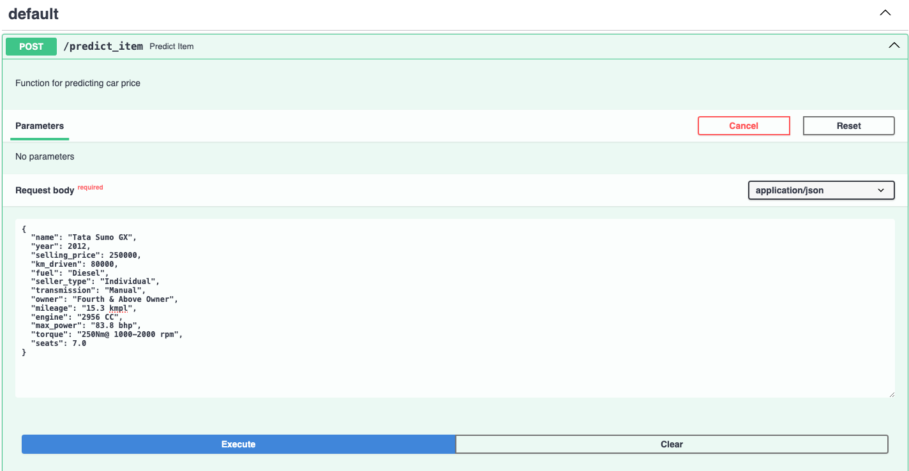

# Результаты работы
## Что было сделано:
- Preprocessing:
  * Очистка данных от дубликатов, заполнение пропусков, преобразование столбцов mileage, engine, max_power к float
  * Убраны столбцы torque и name
- EDA:
  * По предложенным для построения графикам были сделаны следующие выводы:
    - Между целевой переменной и признаком *max_power* заметна зависимость
    - Между некоторыми признаками есть как линейные, так и нелинейные зависимости
    - Между категориальными переменными и целевой переменной есть зависимость
- Feature engineering:
  * Были добавлены полиномиальные признаки
  * Пропущенные значения были заполнены с помощью KNNImputer
  * Признак name был использован для определения марки автомобиля
  * One-hot кодирование категориальных признаков
- Models:
  * Ridge с коэффициентом регуляризации $\lambda = 30.0$, подобранным с помощью GridSearch с 10 фолдами. \
    **Метрики лучшей модели**:\
    Train metrics: r2 = 0.7960622276122082, MSE = 58456384205.64551 \
    Test metrics: r2 = 0.7925620955515329, MSE = 119241230998.778
## Что дало наибольший буст:
  Использование признаков, полученных в результате Feature engineriing'а: использование полиномов степени 2 численных признаков, марки автомобилей, KNNImputer для заполнения пропусков.

## Что сделать не вышло и почему (из-за нехватки времени):
  * Использовать признак *torque*
  * Проанализировать выбросы в данных
  * Спарсить дополнительные данные по автомобилям

## Скриншоты работы сервиса:
### POST /predict_item на вход в формате json подаются признаки одного объекта, на выходе сервис выдает предсказанную стоимость машины:

### POST /predict_items на вход подается csv-файл с признаками тестовых объектов, на выходе получаем файл с +1 столбцом - предсказаниями на этих объектах (результат со скриншота в /data):

